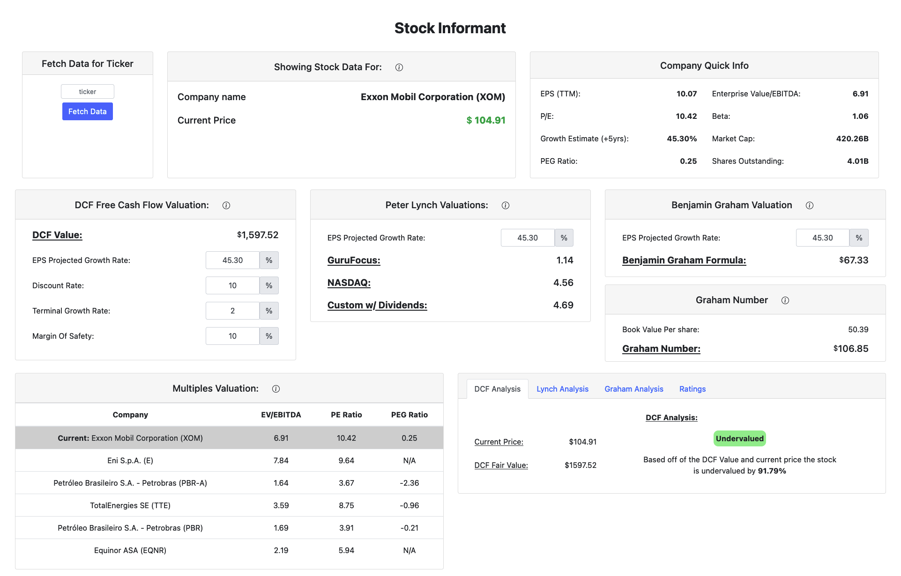

# Stock Informant

Stock Informant is an easy to use dashboard to perform some fundamental valuation on a stock.


## Description

 The purpose of stock informant was to create an easy to use program that fetches required data and perform some valuation calculations to help determine a stocks intrinsic value without having to manually do all this in Excel. Stock Informant provides some company information and financial data that are then used in the calculations. Some detail is provided for the calculations as to their purpose and values used (just hover over the info circle for the boxes that have it). It also provides some analysis, based off of the calculations and their values, to determine if it thinks the stock is fairly-valued/undervalued/overvalued. It uses yahooquery api to gather stock information and Flask to output to a local server to display the data on the dashboard.

 ## Screenshot
 

## Getting Started

### Dependencies

* Any of the following:
    * Windows 10
    * Ubuntu
    * MacOS

### Installing

* Go the the releases section and download required binary/executable for your targeted OS (if downloading zip for mac, extract then run)

### Executing program

* To run the program just run the exe/binary file
---
### A note on current MacOS issues
* Currently on MacOS with the most recent software version, the app is not using flaskwebgui like the windows and linux versions. This is because there are some threading issues with "objc_initializeAfterForkError" (a quick [google search](https://www.google.com/search?channel=ftrc&client=firefox-b-1-d&q=objc_initializeAfterForkError) of that should show you the issue). So as of right now the workaround without adjusting users environment variables is to open a web browser and handle the browser close with javascript to kill the process.
* If you are on Mac and the process is still running and the browser window is closed or their is odd behavior within the browser, either ctrl+c in the terminal where the server is running or close the terminal window.
---
## Help
For the MacOS install you will probably run into "“stock-informant” cannot be opened because it is from an unidentified developer.". To fix this:
* Open System Settings.
* Click Privacy & Security, scroll down, and click the Open Anyway button to confirm your intent to open or install the app.
* The warning prompt reappears and, if you're absolutely sure that you want to open the app anyway, you can click Open. 
*via* [Apple Website](https://support.apple.com/en-us/HT202491)

On Linux you may need to change the permissions of the binary file to be executable
```
$ sudo chmod +x [binary_file_name]
```

## Version History

* 0.1
    * Initial Release

## License

This project is licensed under the GNU General Public License v3.0 - see the LICENSE.md file for details
